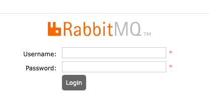

# GSAS 2023 Workshop: Step 2

### Overview

In this step, we will deploy RabbitMQ to our cluster which will be used as our
ISB ("internal service bus"). This will be the bus our applications use to
facilitate EDA - they will publish messages to it and other applications will
consume them.

While the ISB does not _need_ to be RabbitMQ, it has several features that make
it a good choice:

1. Rock-solid stability
2. Predictable (and good enough) performance
3. And most importantly - _extremely_ versatile message routing capabilities

Some of the reasons you may want to choose something else:

1. Not distributed - only has H/A (high availability) mode
2. Generally ~20k msgs/s max throughput with <4KB messages

I would argue that for a service bus, 20K/s is plenty for 99% of use-cases. And
while distributed-by-default would be nice, setting up RabbitMQ in H/A mode is
a common, well-known practice that works very well. Most RabbitMQ providers will
give you a cluster of 3 nodes by default, fronted by HAProxy for load balancing
and failure detection.

### Why not Kafka?

Kafka is NOT a messaging queue. It _can_ be used as a message queue but that
doesn't mean you should. Kafka is first and foremost a distributed commit log - 
it excels at high-throughput writes and reads, streaming huge data volumes and
doing it reliably.

At the same time, Kafka is notoriously difficult to manage and operate and it
has really poor options for message routing. You are limited to writing to a
topic, maybe choosing a partition and key and that's about it.

For example, when using Kafka as a message queue, more often than not, you will
find yourself in a situation where your services will need to consume messages
just to determine if they should actually process the message or not.

The better solution here would be to ensure the message is never seen by the
service at all. Of course, the service should do validation on all messages it
receives, but it should not waste resources reading messages which are not 
relevant to it.

The above can be easily achieved with a proper message queue that supports
subject based routing. 

### Steps

1. `k apply -f deploy.yaml`
   1. Deploy a since RabbitMQ instance 
1. RabbitMQ will take ~1-2 minutes to start up; you can monitor its progress by
running `k logs -f service/rabbitmq-service`
   1. You should see something like this when it's ready:
   ```
   ##  ##      RabbitMQ 3.12.6
   ##  ##
   ##########  Copyright (c) 2007-2023 VMware, Inc. or its affiliates.
   ######  ##
   ##########  Licensed under the MPL 2.0. Website: https://rabbitmq.com
   
   Erlang:      25.3.2.6 [jit]
   TLS Library: OpenSSL - OpenSSL 3.1.3 19 Sep 2023
   Release series support status: supported
   
   Doc guides:  https://rabbitmq.com/documentation.html
   Support:     https://rabbitmq.com/contact.html
   Tutorials:   https://rabbitmq.com/getstarted.html
   Monitoring:  https://rabbitmq.com/monitoring.html
   
   Logs: <stdout>
   
   Config file(s): /etc/rabbitmq/conf.d/10-defaults.conf
   
   Starting broker...2023-10-03 19:17:28.272232+00:00 [info] <0.230.0>
   ```
1. When RabbitMQ is up, let's look at its UI: `k port-forward service/rabbitmq-management 8888`
   1. Open a port-forward for RabbitMQ's management UI
1. We are now ready to test messaging! 
1. Open a browser and go to "http://localhost:8888"
   1. You should see something like this:
   
1. Login w/ username `guest` and password `guest`
Go to exchanges, add new **topic** exchange called `events`
   1. The services we will create and deploy in step 4 and 5 are going to 
   declare queues and bind them to the _events_ exchange.
1. Go to queues, add a new queue called `test`
1. Go to exchanges again, select `events` and add a new binding in the "Add 
binding from this exchange" section
   1. Set "queue" to `test`
   2. Set "routing key" to `#`
   3. Click "Bind"
1. Port-forward RabbitMQ's service port: `k port-forward service/rabbitmq-service 5672:5672`
1. Now we will publish a message to this exchange and see RabbitMQ forward it
to our queue. While you can do this via the UI, we will use another CLI tool for
this, called [`plumber`](https://github.com/streamdal/plumber). We choose to use
`plumber` here because it supports a huge variety of messaging and streaming
tech - not having to switch debug tools is nice!
   1. `brew tap streamdal/public && brew install streamdal/public/plumber` 
   2. Verify plumber is installed: `plumber --help`
   3. Open new terminal tab: `plumber read rabbit -f --verbose-output --exchange-name events --queue-name test --binding-key '#' --queue-durable`
   4. Open new terminal tab: `plumber write rabbit --exchange-name events --routing-key foo --input bar`
   5. You should see the "write" appear on the "read" terminal tab!
      1. It'll look something like this:
      ```
      INFO[0000]
      █▀█ █   █ █ █▀▄▀█ █▄▄ █▀▀ █▀█
      █▀▀ █▄▄ █▄█ █ ▀ █ █▄█ ██▄ █▀▄
      INFO[0000] Listening for messages...                     backend=rabbitmq
      
      ------------- [Count: 1 Received at: 2023-10-03T12:28:30-07:00] -------------------
   
      +------------------------+--------------------------------------------------------------+
      | Exchange               |                                                       events |
      | Routing Key            |                                                          foo |
      | AppID                  |                                                      plumber |
      +------------------------+--------------------------------------------------------------+
   
      bar
      ```
   
### Done

Nice! RabbitMQ is working! We can move on to [step 3](../step-3a-deploy-nats/README.md). 
