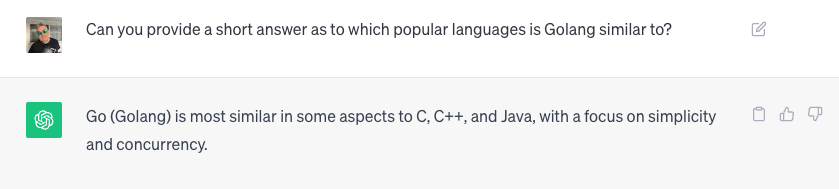

# GSAS 2023 Workshop: Step 4

### Overview

In this step, we will write and deploy our first service that uses EDA.

This service will never be called directly, instead the service will listen to
the ISB (internal service bus) for new user sign-up messages and send out
a "welcome" email to the new user(s).

In this step, we will make the service use all of the components we have deployed
so far and will showcase how it all works together to form a cohesive system
that uses EDA.

The service will be written in [Go](https://go.dev/) which should be easy enough
to follow even if you are not familiar with the language.

From Chat-GPT:



### Steps

NOTE: If you do not have `Go` installed, don't worry about it - the deploy.yaml
is referencing an image that has already been built and pushed to DockerHub :)

1. Open the `welcome-svc` directory in your preferred IDE
2. The entrypoint is `main.go` - read comments (or follow workshop guide) to
understand flow 
   1. `main.go` sets up dependencies - `deps`
   2. `deps/deps.go` instantiates dependencies - RabbitMQ (ISB) and NATS.
   3. Project uses a "service layer" (like in Java)
   4. `deps` sets up NATS as a backend and uses a lib called [`natty`](https://github.com/streamdal/natty)
   5. `deps` sets up RabbitMQ as a service and uses a lib called [`rabbit`](https://github.com/batchcorp/rabbit)
   6. The ISB service launches a consumer, at startup, that will continuously 
   read messages from the ISB and potentially execute a message-specific handler
   method.
3. Let's look at the handler code in `welcome-svc-1/services/isb/isb_shared.go`
4. The handler listens for "sign-up" messages and "sends an email" each time
it reads a message.
5. We will skip building and packaging the service as a Docker img - that can
be a separate talk altogether. Let's deploy an img that has everything already
built: `cd welcome-svc-1 && k apply -f deploy.yaml`
6. Verify that our service is running: `k get pods | grep welcome-svc`
7. Make sure that the pod is in "Running" state!
   1. If not, `k logs -f <pod-name>` to see what's going on

### Now let's test it out!

1. Emit a "sign-up" event to the bus and watch how `welcome-svc` behaves
   1. In a new terminal tab, let's make RabbitMQ accessible locally: `k port-forward service/rabbitmq-service 5672:5672`
   2. In a new terminal tab, watch the service's logs: `k logs -f deployment/welcome-svc-deployment` 
   3. Write a sign-up event to RabbitMQ:
      ```
      cd welcome-svc-1 && plumber write rabbit \
      --exchange-name events \
      --routing-key events.signup.new \
      --input-file plumber-input.json
      ```
   4. The welcome service should have logged a message that it received the event
   and sent an email for the given user!
2. Let's send another sign-up event, for the same user
   1. Not great :/ `welcome-service` sent out _another_ email to the same user
   2. This is where idempotency comes to play - we need to have our `welcome-svc`
   be aware of what it has already processed; this is where `NATS` comes in.
   3. Let's look at `step-4-write-welcome-svc/welcome-svc-2/services/isb/isb_shared.go` 
   handler code to see how we can make our handler idempotent.
3. Re-deploy updated `welcome-svc-2`: `cd welcome-svc-2 && k apply -f deploy.yaml`
4. Watch the logs of the updated service: `k logs -f deployment/welcome-svc-deployment`
5. Emit two more `sign-up` events:
   ```
   cd welcome-svc-2 && plumber write rabbit \
   --exchange-name events \
   --routing-key events.signup.new \
   --input-file plumber-input.json
   ```
6. Verify that `welcome-svc` only sent out one email by looking at logs
   1. You should see the service ignoring the second event as it has already
   processed `foo@bar.com` in the past.
      
### What We Learned

1. The core of our service will be in the handler code
2. ALL services that participate in EDA **MUST** be idempotent
3. We can use a key/value store to implement idempotency in our services 

### Done

Nice, our `welcome-svc` is in good shape. Now let's add a second service into
the mix in [step 5](../step-5-write-billing-svc/README.md)!
